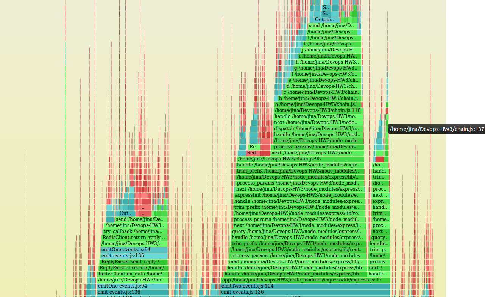
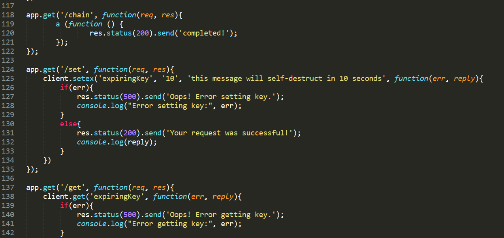
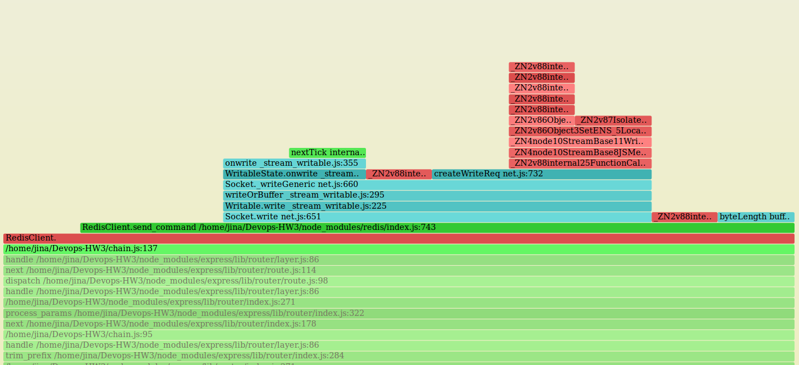
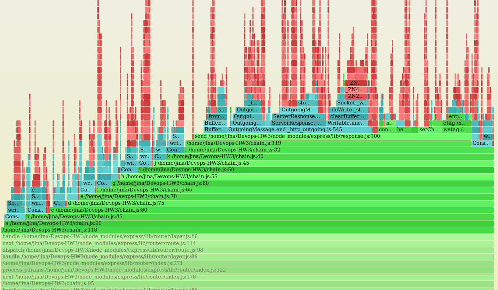
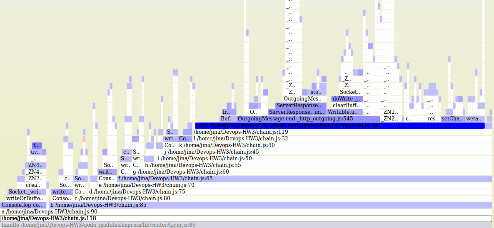
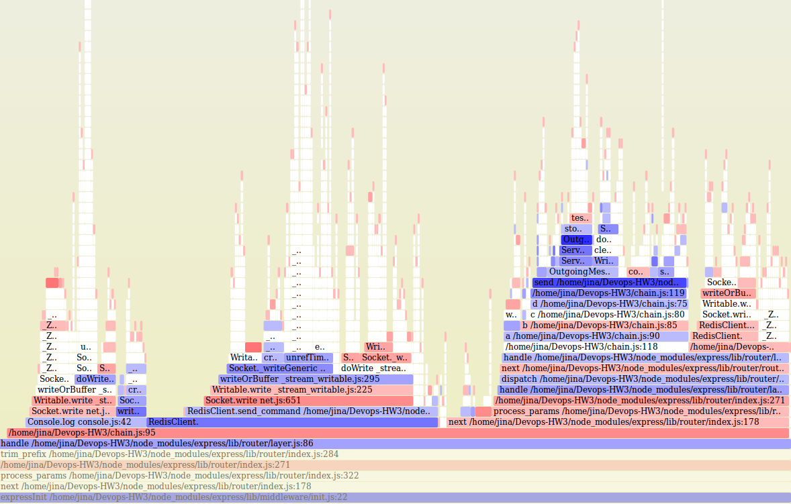
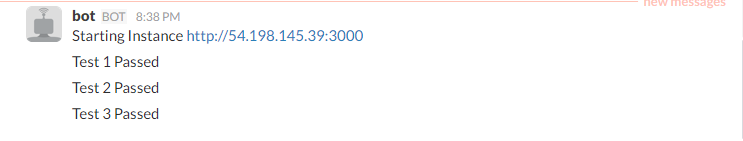
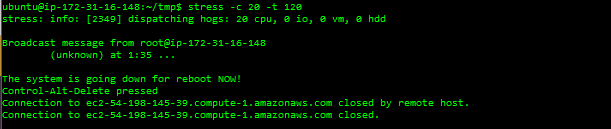
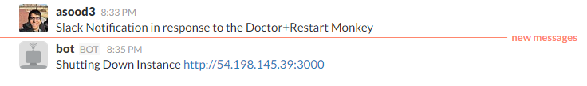

# DevOps-M4
DevOps - MILESTONE: SPECIAL

##Objectives (Monitoring and Analysis):
1. Analysis -
  * Flame Graphs for finding long chains of method calls in code.
  * Differential Graphs for non-regression testing.

2. Restart Monkey + Doctor Monkey: Based on the CPU usage, restart the server and using the proxy to switch the traffic to another server. At the same time when the server restarts, check if the services restarted correctly. Sending a slack notification using the slack Bot which gives the status of the App.  

### Screencast - Class Demo (Login using UnityID)
[Demo Presentation](https://youtu.be/yMcpaCFxxwQ)

##ANALYSIS
###Flamegraphs -
* The svg's for the following graphs can be found [here](/Analysis).
* We are using flamegraphs as a visual technique to find long chains of method calls or any callback helps a node.js app might have. To generate the flamegraphs, we are using [Brendan Gregg's FlameGraph scripts](https://github.com/brendangregg/FlameGraph.git).
* To sample the stack traces of a running process, we are using the Linux profiling tool **perf**.
* To get the language-level context of some JIT symbols used by the node's v8 engine, we run the node.js application with the profiler option, `--perf-basic-prof`.
* Once the node.js app is running, we can start recording the stack traces at a particular sampling frquency (*-F*) for a particular time duration (45 seconds below) or until the process exits with the below command -   
  ```
  perf record -F 9997 -p `pgrep -n node` -g -- sleep 45
  ```
* Now that we have our samples, which will be written to **perf.data** file, we generate a line-based output for flamegraph scripts to read.  
  ```
  perf script | egrep -v "( __libc_start| LazyCompile | v8::internal::| Builtin:| Stub:| LoadIC:|\[unknown\]| LoadPolymorphicIC:)" |\
  
  sed 's/ LazyCompile:[*~]\?/ /' |\
  
  ../FlameGraph/stackcollapse-perf.pl > out.perf-folded
  ```
* Use the intermediate file, *out.perf-folded* to generate the graph with the below command -  
  ```
  ../FlameGraph/flamegraph.pl out.perf-folded --title="Flamegraph - Green = node app function calls, Aqua = node built-ins, Red = System Calls" --colors js > node-flamegraph.svg
  ```  
  
###Profiling our application using flamegraph -
  
A few important characteristics of a flamegraph (from [Brendan Gregg's presentation](https://www.usenix.org/sites/default/files/conference/protected-files/gregg_lisa13_flamegraphs.pdf))- 
* Each box represents a function (a merged stack frame)
* y-axis shows stack depth
  * top function led directly to the profiling event
  * everything beneath it is ancestry (explains why)
* x-axis spans the sample population, sorted alphabetically
* Box width is proportional to the total time a function was profiled directly or its children were profiled  


  
The above flamegraph was generated for our HW3 meow app. We added a new route, '/chain' which calls a long chained function. The above graph was generated for 100 HTTP calls to each '/chain' and '/get' resource.  
For easier viewing experience, we have color coded the functions with the following legends - 
* *Green* boxes corresponding to our JS functions
* *Aqua* depicting node.js built-ins
* *Red* boxes are system calls

The longer green stack depicts the stack trace for our long method corresponding to '/chain' route and the smaller right-most stack for line number 137 is for '/get'.  

On zooming, we can analyse the cause for the significant discrepancy in stack sizes.  

  


### Differential Graph -
Once we have recognized a long chain and maybe made some code changes to flatten it, we might want to generate a *Differential* graph to see the changes in the performance of our app. As a further extension to above analysis, we have tried creating differential graphs to do non-regression testing. Such differential analysis maybe done as a pre or post-commit action.
Below is the differential graph, showing what *will* happen if we flattened our '/chain' related function by some extent.  



In the above graph, the widths show the before profile, colored by what *will* happen.  If a frame is going to appear more number of times in the after profile, it is red and if it appears less times, it is blue. We can see our chain of functions appear less number of time in the after profile compared to their occurence in the before profile. In such differential graph, where widths are the before profile, we can also see code paths which might disappear in the after profile.  

The below differential graph is constructed using the widths of the after profile, colored by what *did* happen. Again, blue means the frame appears lesser times in after profile and red means that it appears more times.



### Generating Differential Graphs - 
* We our using the *difffolded.pl* script from Brendan Gregg's repo and using *perf* as our profiler.
* Get the folded stack samples for the before profile (profile 1) by running - 
```
perf record -F 9997 -p `pgrep -n node` -g -- sleep 45
perf script | egrep -v "( __libc_start| LazyCompile | v8::internal::| Builtin:| Stub:| LoadIC:|\[unknown\]| LoadPolymorphicIC:)" |\
  
sed 's/ LazyCompile:[*~]\?/ /' |\
  
../FlameGraph/stackcollapse-perf.pl > profile1.perf-folded
```
* Get the folded stack samples for the after profile (profile 2) by running - 
```
perf record -F 9997 -p `pgrep -n node` -g -- sleep 45
perf script | egrep -v "( __libc_start| LazyCompile | v8::internal::| Builtin:| Stub:| LoadIC:|\[unknown\]| LoadPolymorphicIC:)" |\
  
sed 's/ LazyCompile:[*~]\?/ /' |\
  
../FlameGraph/stackcollapse-perf.pl > profile2.perf-folded
```
* Now to generate the 2nd type of differential graph we saw above, i.e. the base graph (the widths) will be the after profile and the coloring will be according to the "after - before" delta. If a frame appeared more times in after, it is red and blue if it appeared less. We will run it with the -s and -n options. *-s* removes hexadecimal addresses which were not converted to function names from the stack traces before generating the sample counts for comparison. *-n* option to normalize the first profile count to match that of the second profile. To generate this run - 
```
../FlameGraph/difffolded.pl -n -s profile1.perf-folded profile2.perf-folded | ../FlameGraph/flamegraph.pl > diff_2.svg
```
* To generate the first type of differential graph, i.e. to have the widths as the before profile and the coloring to still be as the "after - before" delta, run the following command. The *--negate* option will invert the coloring scheme to give the "after - before" delta coloring as expected, i.e. blue still means that the frames will be seen lesser times in after profile and red for more -
```
../FlameGraph/difffolded.pl profile2.perf-folded profile1.perf-folded | ../FlameGraph/flamegraph.pl --negate > diff_1.svg
```
**Note** - The normalization function of the script does not seem to be working as expected, take for e.g. our above example. We will expect the trace e() -> f() -> g() -> h() and so on to be completely white in our 1st differential graph, i.e., the delta value to be -100% since it disappers from after profile completely. But the results do not match.

### Screencast - Analysis (Login using UnityID)
[Analysis Detailed ScreenCast](https://youtu.be/eB_k3gD2Lxk)

[Reference](http://www.brendangregg.com/blog/2014-11-09/differential-flame-graphs.html)


##MONITORING
###Doctor+Restart Monkey with Slack Notifications
We use the [DevOps Milestone 3](https://github.ncsu.edu/jhjain/DevOps-M3) to initialize the instances on the Amazon AWS. We have a redis-server, a proxy server and four production server running the app.
The [App](https://github.ncsu.edu/asood3/DevOps-M4/tree/master/Monitoring/App) and the [Proxy](https://github.ncsu.edu/asood3/DevOps-M4/tree/master/Monitoring/Proxy) code is provided in the repository.


For the Restart Monkey setup we use the [app.conf](https://github.ncsu.edu/asood3/DevOps-M4/blob/master/Monitoring/Scripts/app.conf) file to start the app as a service.
We place the file in the /etc/init with sudo privileges. We can start and stop this service using the code below from anywhere in the server.
```
sudo start app
sudo stop app
```

This script is used to start the service when we restart the server. This implements our first part of the Restart Monkey. 
The second part to test the service is implemented in the [slacknotifystart.py](https://github.ncsu.edu/asood3/DevOps-M4/blob/master/Monitoring/Monkey/slacknotifystart.py). 
The three tests implemented are:
* *Test1* to check if any content if received.
* *Test2* to check the status code of the response.
* *Test3* to ping the public IP to check the binding with the private IP address.
The code not only tests the service but also sends a slack notification using the slack Bot.

Below is the screenshot of the slack notification after the restart of the instance with the status of the tests.



For the Doctor Monkey setup we use the [loop](https://github.ncsu.edu/asood3/DevOps-M4/blob/master/Monitoring/Scripts/loop) script.
We start this script as a daemon process which every 30 seconds runs the [monkey.js](https://github.ncsu.edu/asood3/DevOps-M4/blob/master/Monitoring/Monkey/monkey.js).
The code checks for the CPU utilization to monitor the health of the system. If the CPU utilization goes above the set threshold, the instance reboots and sends a slack notification using [slacknotifystop.py](https://github.ncsu.edu/asood3/DevOps-M4/blob/master/Monitoring/Monkey/slacknotifystop.py).
The traffic is redirected to other active instances using the proxy server which used the global redis list. Once the instance comes back online, it is added back to the global redis list.

Below is the screenshot of stress test that reboots the instance and the slack notification.



Note: 
* *package.json* and *requirements.txt* is provided for the dependency management.
* All the scripts and the code is running locally in the instance.
* The tokens used for the notification and the ec2 reboot are configured on every server as environment variable.

### Screencast - Monitoring (Login using UnityID)
[Monitoring Detailed ScreenCast](https://youtu.be/ohuHU6FgN4I)

Links: 
* [DevOps Milestone 1](https://github.ncsu.edu/asood3/M1)
* [DevOps Milestone 2](https://github.ncsu.edu/jhjain/DevOps---M2)
* [DevOps Milestone 3](https://github.ncsu.edu/jhjain/DevOps-M3)
* [DevOps Milestone 4](https://github.ncsu.edu/asood3/DevOps-M4)
